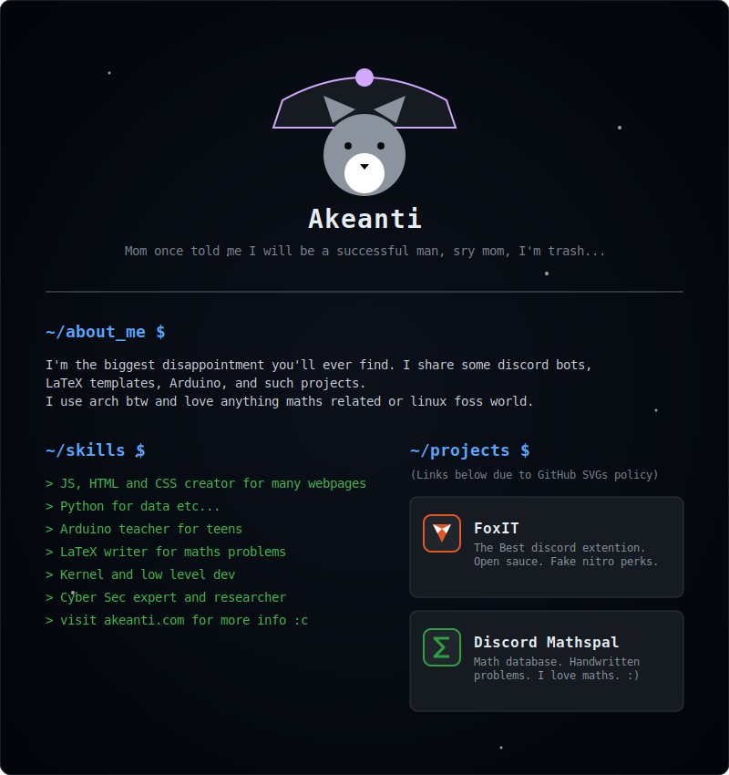

  

  <picture>
    
  </picture>
  
   
  
  

    <a href="https://discord.gg/HaGWkcahq3"><b>My server</b></a>
  

   

  

   

  <table border="0">
    <tr>
      <td colspan="2" align="center">
        
      </td>
    </tr>
    
<tr>
      <td colspan="2" align="center">
        
        
        
      </td>
    </tr>

<tr>
      <td align="center" width="25%">
         
      </td>
      <td align="center" width="25%">
         
        
      </td>
    </tr>
  </table>

  

