<p>
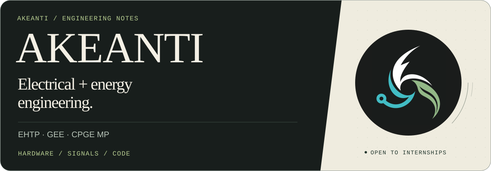
</p>

<p align="center">
  <a href="https://akeanti.xyz"></a>
  <a href="mailto:akeantie@gmail.com"></a>
  <a href="#selected-work"></a>
  <a href="#what-i-bring"></a>
  <a href="#art-notebook"></a>
</p>

## It started with a PC

I was **six when I opened my dad’s old PC**. I wanted to know what was inside, and electronics became something I kept coming back to.

Now I study **Génie Électrique et Énergétique at EHTP**, after **CPGE MP** and the **CNC**. I’m interested in how measurements from real equipment can help us understand faults. That has led me to projects on power grids, electrolyzers, and wireless power transfer.

<p align="center">
  <a href="#it-started-with-a-pc">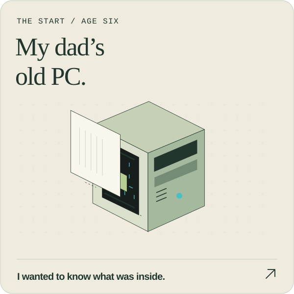</a>
  <a href="#my-mission">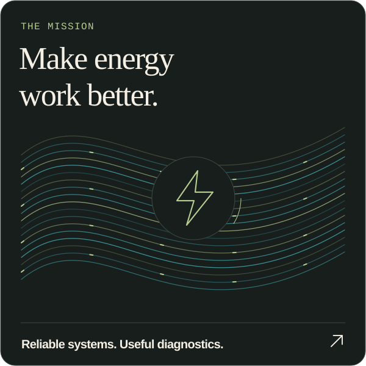</a>
</p>

## My mission

I want to help electrical systems waste less energy and catch problems earlier. That starts with understanding the hardware, getting useful measurements, and building models whose results people can make sense of. That's the kind of engineering I want to get good at.

## Selected work

<p align="center">
  <a href="#grid-project">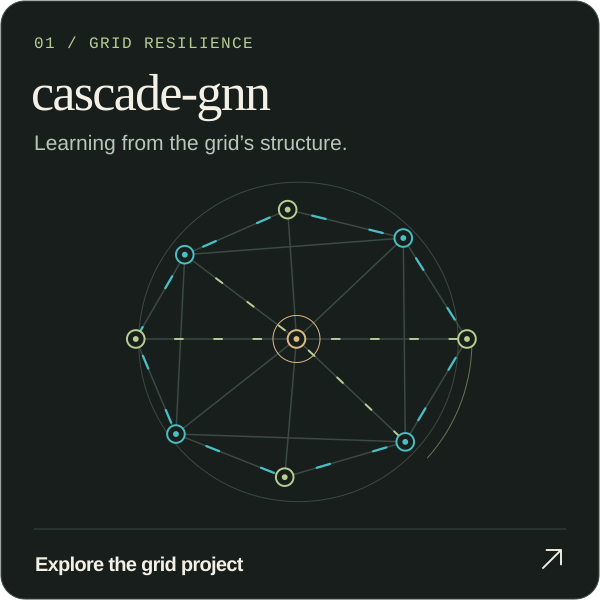</a>
  <a href="#pem-project">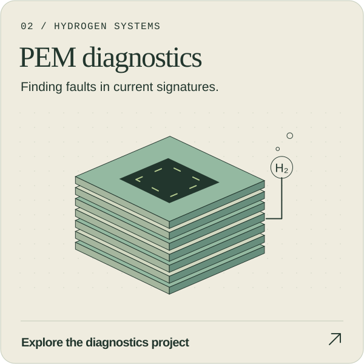</a>
</p>

### Grid project

**cascade-gnn** studies cascading grid failures using the **PowerGraph** dataset. I compare graph models with an **XGBoost** baseline, inspect predictions with **GNNExplainer**, and bring the results into **Streamlit**.

### PEM project

A student competition project exploring **MCSA-inspired current analysis** for PEM electrolyzer faults. It combines signal features, **XGBoost**, and **SHAP** to help explain the predictions.

<p align="center">
  <a href="#bench-notes">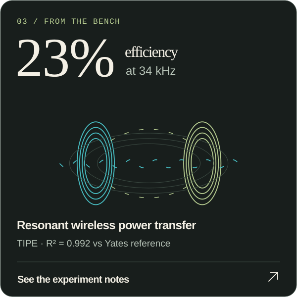</a>
  <a href="#what-i-bring">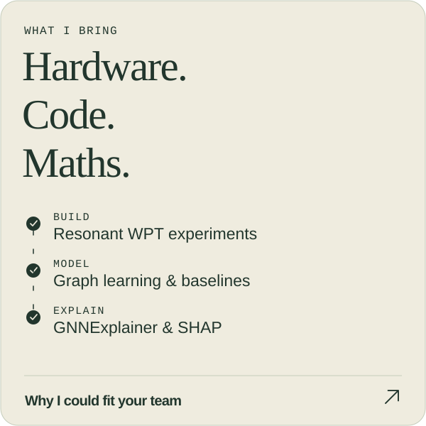</a>
</p>

### Bench notes

My **TIPE wireless-power prototype reached 23% efficiency at 34 kHz**, with **R² = 0.992** in a model comparison against the Yates reference. I'm also developing an **OT / SCADA anomaly-detection dashboard**.

## What I bring

- **Hardware and code, together.** My projects connect resonant power transfer, embedded acquisition, signal analysis, and Python-based modelling.
- **Results I can talk through.** I use baseline comparisons, GNNExplainer, and SHAP to inspect what a model is doing and explain the result.
- **A maths foundation and work on the bench.** CPGE MP gave me the foundations. The WPT prototype and diagnostic projects give me a place to apply them, test things, and improve.

The internship I’m looking for has room for both a notebook and a workbench. I’d be glad to help with measurements, prototypes, data analysis, or diagnostic tools, and learn from the engineers around me.


## Art notebook

A few drawings around the things I like working on. The signals and scenes here are illustrations; the project results are in the notes above.

<details open>
<summary><b>Animated studies</b> · collapse the extra artwork</summary>

<p>
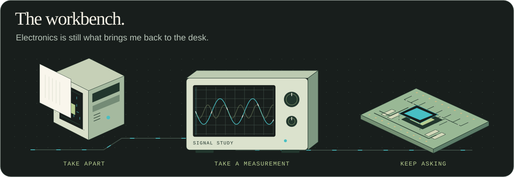
</p>

<p align="center">
  <a href="./assets/scope-study.svg">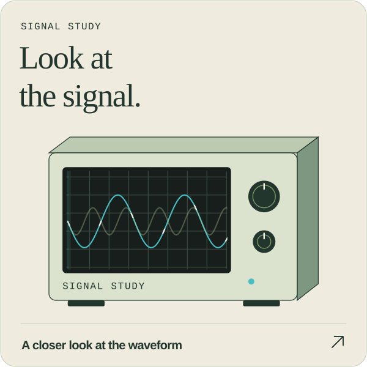</a>
  <a href="./assets/pcb-study.svg">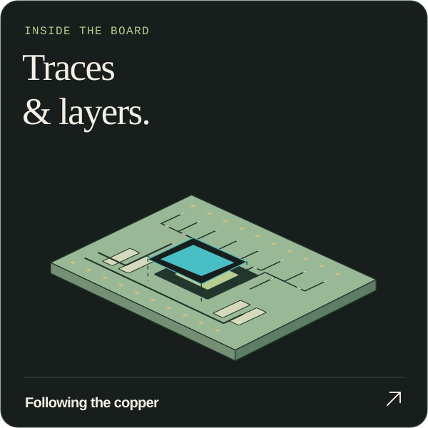</a>
</p>

<p align="center">
  <a href="./assets/phase-study.svg">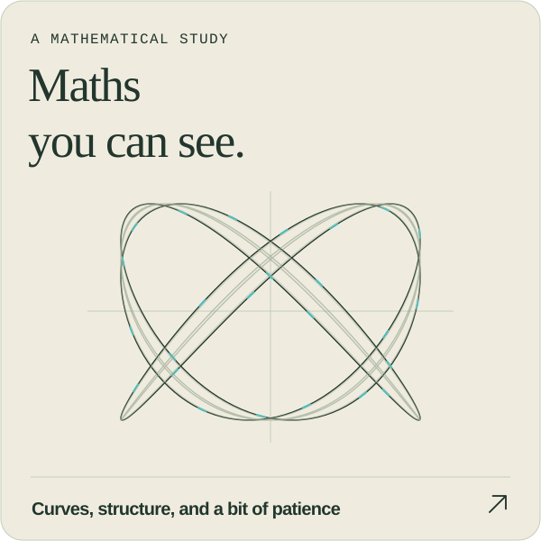</a>
  <a href="./assets/resonance-study.svg">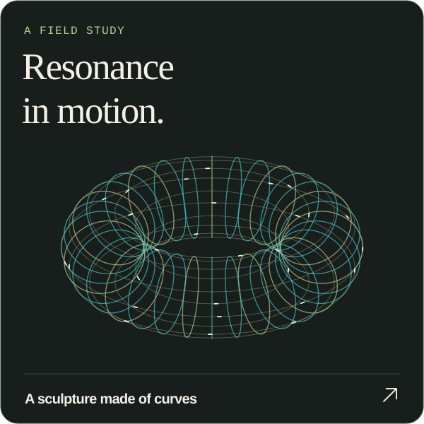</a>
</p>

<p align="center">
  <a href="./assets/notebook-study.svg">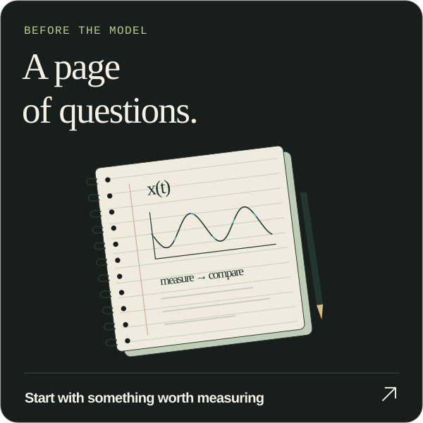</a>
  <a href="./assets/after-hours.svg">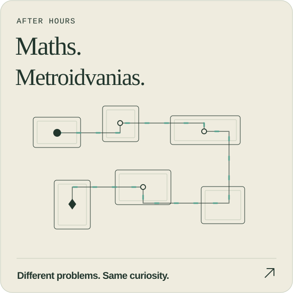</a>
</p>

<p>
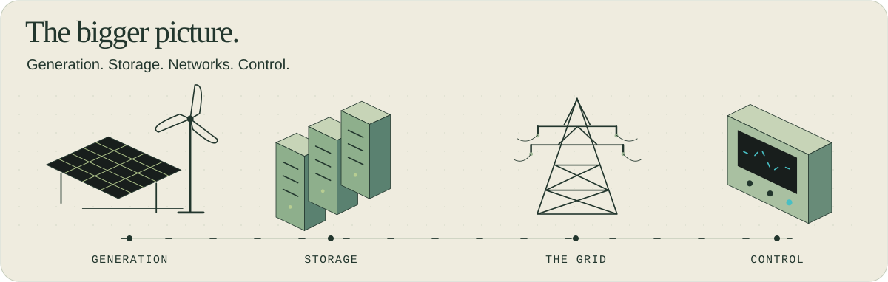
</p>

</details>

## Workbench

<details open>
<summary><b>Workflow, tools &amp; journey</b> · collapse for a shorter profile</summary>

<p>
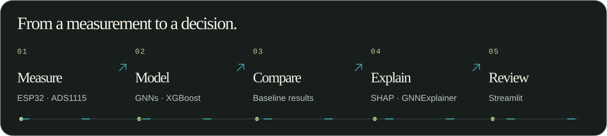
</p>

<p>
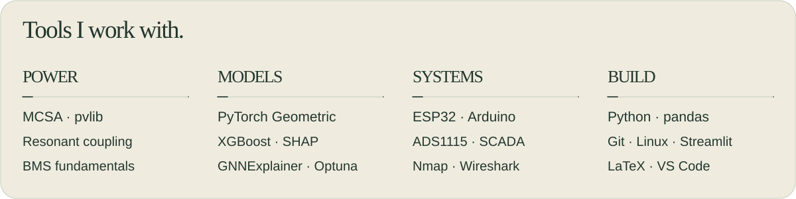
</p>

<p>

</p>

</details>

<details>
<summary><b>The short version</b></summary>

```text
akeanti
├── studying    Electrical & energy, EHTP
├── foundation  CPGE MP · CNC
├── building    Grid & PEM diagnostics
├── learning    BMS · renewables · OT security
└── offline     Maths · metroidvanias
```

**Tools:** Python, PyTorch Geometric, XGBoost, SHAP, GNNExplainer, Optuna, pandas, MCSA, pvlib, ESP32, Arduino, ADS1115, SCADA, Nmap, Wireshark, Git, Linux, Streamlit, LaTeX, and VS Code.

</details>

### Off the bench

I also enjoy competitive mathematics and metroidvania games. There’s usually another problem to get absorbed in.

## Let's talk

I'm open to **internships / stage / PFA** in electrical and energy engineering, industrial AI, or OT cybersecurity. **Morocco or abroad**, on-site, hybrid, or remote.

<p>
<a href="mailto:akeantie@gmail.com">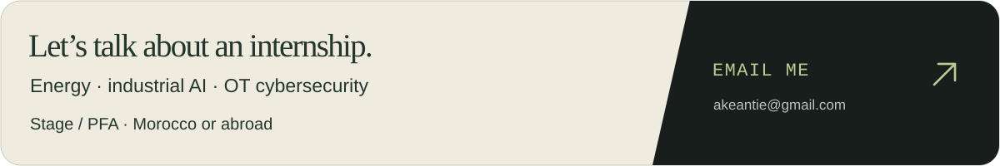</a>
</p>

<p align="center">
  <a href="https://akeanti.xyz"><b>akeanti.xyz</b></a> &nbsp;·&nbsp;
  <a href="mailto:akeantie@gmail.com"><b>akeantie@gmail.com</b></a>
</p>
