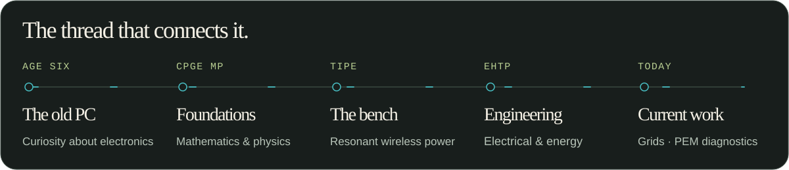

-2ea44f?style=flat-square)

1st-year **Génie Électrique et Énergétique** @ **EHTP**, Casablanca (CNC concours, ex-CPGE MP). I build diagnostics for the physical layer of power systems: motors, electrolyzers, grids, and the models that predict when they'll fail.

Watching Morocco's industrial energy build-out closely, OCP's green hydrogen push especially, while prepping for **ECC-Entreprises**, **FENELEC**, and **Solaire Expo Maroc** this cycle.

### Flagship builds

| Project | Type | What it does | Stack |
|---|---|---|---|
| **cascade-gnn** |  | GNNs predicting cascading grid failures, benchmarked against XGBoost, explained with GNNExplainer, trained on the PowerGraph (NeurIPS 2024) dataset. |    |
| **PEM Electrolyzer Fault Diagnostics** |  | Extends motor current signature analysis (MCSA) to catch fault signatures in PEM electrolyzer operation, built for a student competition entry. |     |

Also on the bench: an OT/SCADA anomaly-detection dashboard, and the resonant WPT rig behind the 23% figure above.

### Trajectory

### Toolbox

EHTP GEE (CNC concours, ex-CPGE MP) · BMS, industrial-control security, and renewables coursework in progress (Coursera)

**Open to internships (stage/PFA):** electrical & energy engineering · AI for industrial systems · OT/industrial cybersecurity 
remote, hybrid, or on-site, Morocco or abroad

Outside of this: competitive math with Math&Maroc (targeting 2027), and metroidvania games

