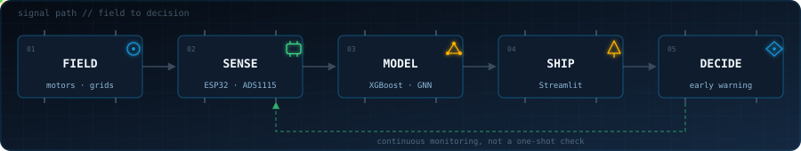
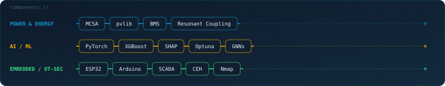

[EMAIL](mailto:akeantie@gmail.com) &nbsp;·&nbsp;  [akeanti.xyz](https://akeanti.xyz) &nbsp;·&nbsp; open to internships from 

1st-year Génie Électrique et Énergétique @ **EHTP**, Casablanca, in via the national CNC concours, ex-CPGE MP. I build diagnostics for the physical layer of power systems: motors, electrolyzers, grids, and the models that predict when they'll fail.

Watching Morocco's industrial energy build-out closely, OCP's green hydrogen push especially. Preparing for ECC-Entreprises, FENELEC, and Solaire Expo Maroc this cycle.

| 23% | R² 0.992 | CEH | NeurIPS '24 |
|:--:|:--:|:--:|:--:|
| WPT efficiency @ 34 kHz, up from 7.4% | fit vs. Yates model (TIPE) | certified ethical hacker | PowerGraph benchmark, `cascade-gnn` |

**Flagship builds**

| **cascade-gnn** `flagship` | **PEM Electrolyzer Fault Diagnostics** `competition` |
|---|---|
| GNNs predicting cascading grid failures — benchmarked against XGBoost, explained with GNNExplainer, trained on the PowerGraph (NeurIPS 2024) dataset. | Extends motor current signature analysis (MCSA) to catch fault signatures in PEM electrolyzer operation. Built for a student competition entry. |
| `PyTorch Geometric` `XGBoost` `Streamlit` | `Python` `MCSA` `XGBoost` `SHAP` |

Also on the bench: an OT/SCADA anomaly-detection dashboard, and the resonant WPT rig behind the 23% figure above.

**Toolbox**

EHTP - Génie Électrique et Énergétique (CNC concours, ex-CPGE MP) · CEH certified · BMS, industrial-control security, and renewables coursework in progress (Coursera).

---

commit activity 
<picture>
  <source media="(prefers-color-scheme: dark)" srcset="https://raw.githubusercontent.com/akeanti/akeanti/output/github-contribution-grid-snake-dark.svg"/>
  
</picture>

Open to internships (stage/PFA) in electrical &amp; energy engineering, AI for industrial systems, or OT/industrial cybersecurity | remote, hybrid, or on-site, Morocco or abroad.

Outside of this: competitive math with Math&amp;Maroc (targeting 2027), and metroidvania games.

