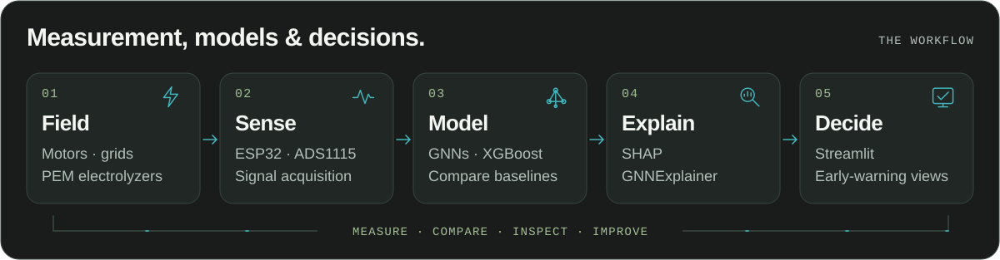

<p>
<picture>
  <source media="(max-width: 640px)" srcset="./assets/banner-mobile.svg">
  
</picture>
</p>

<p align="center">
  <a href="https://akeanti.xyz"></a>
  <a href="mailto:akeantie@gmail.com"></a>
  <a href="#contact"></a>
</p>

<p align="center">
  <a href="#work">Work</a> &nbsp;·&nbsp;
  <a href="#studio">Studio</a> &nbsp;·&nbsp;
  <a href="#about">About</a> &nbsp;·&nbsp;
  <a href="#contact">Contact</a>
</p>

I study **electrical and energy engineering at EHTP**. I work on fault detection in grids and electrolyzers, experiment with wireless power transfer, and explore embedded systems and industrial cybersecurity.

### Work

| Project | What I'm working on |
| :--- | :--- |
| **cascade-gnn** | Cascading grid failures using **PowerGraph**, **PyTorch Geometric**, and an **XGBoost** baseline. Model inspection with GNNExplainer; results in Streamlit. |
| **PEM diagnostics** | A student competition project exploring **MCSA-inspired current analysis** for electrolyzer faults, with **XGBoost** and **SHAP**. |
| **Resonant WPT** | A TIPE prototype reaching **23% efficiency at 34 kHz**, with **R² = 0.992** in a model comparison against the Yates reference. |
| **OT / SCADA** | An anomaly-detection dashboard in development. |


### Studio

<details open>
<summary><b>Visual gallery</b> · collapse for compact view</summary>

<p>
<picture>
  <source media="(max-width: 640px)" srcset="./assets/project-grid-mobile.svg">
  
</picture>
</p>

<p>
<picture>
  <source media="(max-width: 640px)" srcset="./assets/project-pem-mobile.svg">
  
</picture>
</p>

<p>
<picture>
  <source media="(max-width: 640px)" srcset="./assets/bench-mobile.svg">
  
</picture>
</p>

<p>
<picture>
  <source media="(max-width: 640px)" srcset="./assets/signal-path-mobile.svg">
  
</picture>
</p>

<p>
<picture>
  <source media="(max-width: 640px)" srcset="./assets/stack-mobile.svg">
  
</picture>
</p>

<p>
<picture>
  <source media="(max-width: 640px)" srcset="./assets/journey-mobile.svg">
  
</picture>
</p>

</details>

<details>
<summary><b>Toolbox, in text</b></summary>

```text
toolbox
├── power       MCSA · pvlib · resonant coupling
├── models      PyTorch Geometric · XGBoost
├── explain     GNNExplainer · SHAP
├── tuning      Optuna
├── data        Python · pandas
├── embedded    ESP32 · Arduino · ADS1115
├── security    SCADA · Nmap · Wireshark
├── build       Git · Linux · Streamlit
└── write       LaTeX · VS Code
```

</details>

### About

```text
akeanti
├── studying    EHTP · electrical & energy
├── foundation  CPGE MP · CNC
├── learning    BMS · renewables · industrial security
└── offline     Competitive mathematics · metroidvanias
```

### Contact

<p>
<a href="mailto:akeantie@gmail.com">
<picture>
  <source media="(max-width: 640px)" srcset="./assets/contact-panel-mobile.svg">
  
</picture>
</a>
</p>

<p align="center">
  <a href="https://akeanti.xyz"><b>akeanti.xyz</b></a> &nbsp;·&nbsp;
  <a href="mailto:akeantie@gmail.com"><b>akeantie@gmail.com</b></a>
</p>
