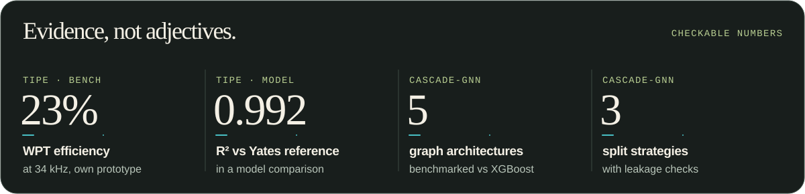
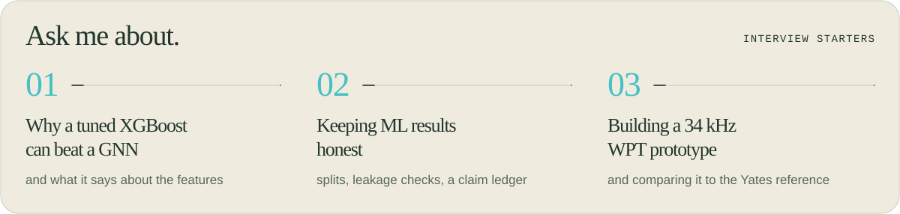
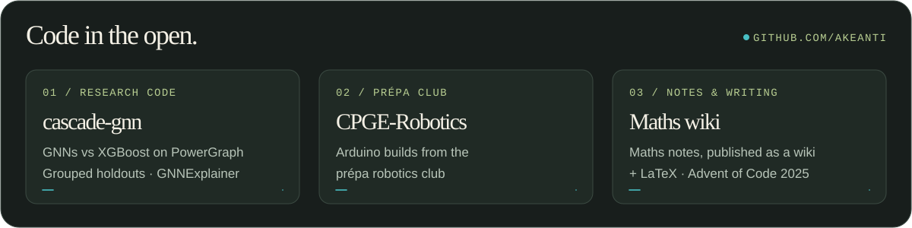

<a name="top"></a>

<p>

</p>

<p>
<a href="#whats-next"></a>
</p>

<p align="center">
  <a href="https://github.com/akeanti/cascade-gnn"></a>
  <a href="mailto:akeantie@gmail.com?subject=CV%20request%3A%20%5Bcompany%5D%20internship&amp;body=Hi%20Akeanti%2C%0D%0A%0D%0ACould%20you%20send%20me%20your%20CV%3F%0D%0A%0D%0ACompany%3A%0D%0ARole%20%2F%20team%3A%0D%0AInternship%20dates%3A%0D%0ALocation%20%2F%20work%20mode%3A%0D%0A%0D%0AThanks%2C"></a>
  <a href="#role-fit"></a>
  <a href="#whats-next"></a>
  <a href="mailto:akeantie@gmail.com"></a>
</p>

<p align="center">
  <b>Measurements in. Explainable models out.</b><br>
  <sub>Electrical &amp; energy engineering student at EHTP · diagnostics for power grids and electrolyzers · ideas tested on the bench</sub>
</p>

<p>
<a href="#recruiter-desk"></a>
</p>

<a name="selected-work"></a>

<p>

</p>

<p>

</p>

<p align="center">
  <a href="https://github.com/akeanti/cascade-gnn"></a>
  <a href="#pem-project"></a>
</p>

### Grid project

<p>
<a href="https://github.com/akeanti/cascade-gnn/actions"></a>


<a href="https://github.com/akeanti/cascade-gnn/blob/main/docs/CLAIMS.md"></a>
</p>

**[cascade-gnn](https://github.com/akeanti/cascade-gnn)**: early warning for cascading failures in power grids, built on the **PowerGraph** (NeurIPS 2024) dataset.

- **Problem:** after an initial outage, will the grid fail to serve demand, or cascade into more branch trips?
- **Approach:** five graph neural network variants against **XGBoost** baselines; random, operating-condition and contingency-grouped splits with **leakage checks**; **gradient × input** and **integrated-gradients** edge attributions scored against the simulated cascade; a **Streamlit** demo.
- **Result:** v0.3 runs end to end with **14 passing tests in CI**, Docker, and a claim ledger that separates what the code shows from what still needs the official PowerGraph runs. No benchmark score is claimed yet.
- **Stack:** Python · PyTorch · XGBoost · scikit-learn · Streamlit · Docker · GitHub Actions · LaTeX

<p>
<a href="https://github.com/akeanti/cascade-gnn"></a>
</p>

### PEM project

A student competition project on **fault diagnostics for PEM electrolyzers**.

- **Problem:** spot faults in a PEM electrolyzer from its electrical current signals.
- **Approach:** **MCSA-inspired** current-signal features, an **XGBoost** classifier, and **SHAP** to show which features drive each prediction.
- **Stack:** Python · signal processing · XGBoost · SHAP

<p align="center">
  <a href="#bench-notes"></a>
  <a href="#what-i-bring"></a>
</p>

### Bench notes

My **TIPE** project: a resonant **wireless power transfer** prototype, built and measured on the bench.

- **Result:** **23% efficiency at 34 kHz**, with **R² = 0.992** in a model comparison against the Yates reference.
- **In progress:** an **OT / SCADA anomaly-detection dashboard**.

<p align="right"><sub><a href="#top">↑ back to top</a></sub></p>

<a name="role-fit"></a>

<p>

</p>

<p>

</p>

| If you're hiring for… | Start here |
| :-- | :-- |
| **Power systems & grid analytics** | [cascade-gnn](https://github.com/akeanti/cascade-gnn) · [how it works](#grid-project) |
| **Energy & hydrogen systems** | [PEM diagnostics](#pem-project) |
| **Power electronics & test bench** | [WPT prototype: 23% at 34 kHz](#bench-notes) |
| **Industrial AI & data** | [cascade-gnn](https://github.com/akeanti/cascade-gnn) · [PEM diagnostics](#pem-project) |
| **OT / ICS security** | OT / SCADA anomaly-detection dashboard *(in progress)* · Nmap · Wireshark |
| **Embedded & instrumentation** | [CPGE-Robotics](https://github.com/akeanti/CPGE-Robotics) · ESP32 · ADS1115 |

### What I bring

- **Hardware and code, together.** My projects connect resonant power transfer, embedded acquisition, signal analysis, and Python-based modelling.
- **Results I can defend.** I use baselines, grouped splits, integrated gradients and SHAP to check what a model is really doing, and I write down which claims the evidence supports.
- **A maths foundation and work on the bench.** CPGE MP gave me the foundations. The WPT prototype and diagnostic projects give me a place to apply them, test things, and improve.

The internship I’m looking for has room for both a notebook and a workbench. I’d be glad to help with measurements, prototypes, data analysis, or diagnostic tools, and learn from the engineers around me.

<p>
<a href="mailto:akeantie@gmail.com?subject=Internship%20conversation"></a>
</p>

<p align="right"><sub><a href="#top">↑ back to top</a></sub></p>

<a name="whats-next"></a>

<p>

</p>

<p>

</p>

<p align="center">
  <b>Stay tuned: I’m cooking more, and this board fills up as the work ships.</b><br>
  <sub>Hit <b>Follow</b> on this profile to catch the next release.</sub>
</p>

<p align="center">
  <a href="https://github.com/akeanti/akeanti/commits/main"></a>
</p>

<p align="right"><sub><a href="#top">↑ back to top</a></sub></p>

<a name="it-started-with-a-pc"></a>

<p>

</p>

I was **six when I opened my dad’s old PC**. I wanted to know what was inside, and electronics became something I kept coming back to.

Now I study **Génie Électrique et Énergétique at EHTP**, after **CPGE MP** and the **CNC**. I’m interested in how measurements from real equipment can help us understand faults. That has led me to projects on power grids, electrolyzers, and wireless power transfer.

<p align="center">
  <a href="#it-started-with-a-pc"></a>
  <a href="#my-mission"></a>
</p>

### My mission

I want to help electrical systems waste less energy and catch problems earlier. That starts with understanding the hardware, getting useful measurements, and building models whose results people can make sense of. That's the kind of engineering I want to get good at.

<p>

</p>

<p align="right"><sub><a href="#top">↑ back to top</a></sub></p>

<a name="how-i-work"></a>

<p>

</p>

<p>

</p>

<p>

</p>

<p align="right"><sub><a href="#top">↑ back to top</a></sub></p>

<a name="code-in-the-open"></a>

<p>

</p>

<p>
<a href="https://github.com/akeanti?tab=repositories"></a>
</p>

| Project | What it is |
| :-- | :-- |
| [**cascade-gnn**](https://github.com/akeanti/cascade-gnn) | Graph neural networks vs XGBoost for cascading grid failures on PowerGraph, with edge attributions, CI tests and a Streamlit demo. |
| [**CPGE-Robotics**](https://github.com/akeanti/CPGE-Robotics) | Arduino projects from the prépa robotics club. |
| [**Maths wiki**](https://akeanti.github.io/Maths-Ain-t-Mathing-Wiki/) | My own maths notes, written up as a wiki. |
| [**LaTeX**](https://github.com/akeanti/LaTeX) | Templates and documents I've typeset. |
| [**Advent of Code 2025**](https://github.com/akeanti/Advent-of-code-2025) | Python solutions with write-ups. |

<p align="right"><sub><a href="#top">↑ back to top</a></sub></p>

<a name="off-the-bench"></a>

<p>

</p>

I also enjoy competitive mathematics and metroidvania games. There’s usually another problem to get absorbed in. I draw around the things I work on too; the signals and scenes below are illustrations, and the project results are in the notes above.

<details>
<summary><b>Open the art notebook</b> · animated studies</summary>

<p>

</p>

<p align="center">
  <a href="./assets/scope-study.svg"></a>
  <a href="./assets/pcb-study.svg"></a>
</p>

<p align="center">
  <a href="./assets/phase-study.svg"></a>
  <a href="./assets/resonance-study.svg"></a>
</p>

<p align="center">
  <a href="./assets/notebook-study.svg"></a>
  <a href="./assets/after-hours.svg"></a>
</p>

<p>

</p>

</details>

<p align="right"><sub><a href="#top">↑ back to top</a></sub></p>

<a name="recruiter-desk"></a>
<a name="lets-talk"></a>

<p>

</p>

I'm looking for a **summer 2027 internship (1–2 months)** in electrical and energy engineering, industrial AI, or OT cybersecurity. **Morocco or abroad**, on-site, hybrid, or remote. I work in **Arabic, French and English**. **CV available on request.**

<p align="center">
  <a href="mailto:akeantie@gmail.com?subject=CV%20request%3A%20%5Bcompany%5D%20internship&amp;body=Hi%20Akeanti%2C%0D%0A%0D%0ACould%20you%20send%20me%20your%20CV%3F%0D%0A%0D%0ACompany%3A%0D%0ARole%20%2F%20team%3A%0D%0AInternship%20dates%3A%0D%0ALocation%20%2F%20work%20mode%3A%0D%0A%0D%0AThanks%2C"></a>
  <a href="mailto:akeantie@gmail.com?subject=Call%20about%20a%20%5Bcompany%5D%20internship&amp;body=Hi%20Akeanti%2C%0D%0A%0D%0AI%20would%20like%20to%20set%20up%20a%20short%20call%20about%20an%20internship.%0D%0A%0D%0ACompany%3A%0D%0ARole%20%2F%20team%3A%0D%0AProposed%20times%20(with%20time%20zone)%3A%0D%0AVideo%20link%20or%20phone%3A%0D%0A%0D%0ABest%2C"></a>
  <a href="mailto:akeantie@gmail.com?subject=Internship%20opportunity%3A%20%5Brole%5D%20at%20%5Bcompany%5D&amp;body=Hi%20Akeanti%2C%0D%0A%0D%0AWe%20have%20an%20internship%20that%20could%20fit%20your%20profile.%0D%0A%0D%0ACompany%3A%0D%0ARole%3A%0D%0ADates%20and%20duration%3A%0D%0ALocation%20%2F%20work%20mode%3A%0D%0ALink%20to%20the%20posting%3A%0D%0A%0D%0ABest%2C"></a>
</p>

<p align="center"><sub>Each button opens a pre-filled email in your mail app. Fill in the blanks and send.</sub></p>

<details>
<summary><b>Recruiter FAQ</b> · quick answers</summary>

<br>

**When can you start, and for how long?**<br>
Summer 2027, for 1–2 months. Exact dates on request.

**Where can you work?**<br>
Morocco or abroad: on-site, hybrid or remote.

**Which languages do you work in?**<br>
Arabic (native), French (fluent) and English (professional).

**What are you studying?**<br>
Génie Électrique et Énergétique (electrical and energy engineering) at EHTP, after CPGE MP and the CNC.

**Which roles fit best?**<br>
Power systems, energy and hydrogen, power electronics, industrial AI, OT security and embedded work. See [Where I fit](#role-fit) for the evidence behind each.

**Can I verify your work?**<br>
Yes. cascade-gnn is public with its tests, CI and a [claim ledger](https://github.com/akeanti/cascade-gnn/blob/main/docs/CLAIMS.md). The numbers under [Selected work](#selected-work) come from my projects.

**Can I get your CV?**<br>
Yes: use **Request my CV** above and I'll send it by email.

</details>

<details>
<summary><b>Recruiter quick copy</b> · plain-text profile for your notes or ATS</summary>

```text
Akeanti | Electrical & energy engineering student, EHTP (GEE)
Background   CPGE MP · CNC
Looking for  Summer 2027 internship, 1–2 months
Fields       Electrical & energy engineering · industrial AI · OT security
Location     Morocco or abroad · on-site, hybrid or remote
Languages    Arabic (native) · French (fluent) · English (professional)
Highlights   Resonant WPT prototype: 23% efficiency at 34 kHz, R² = 0.992 vs Yates reference
             cascade-gnn: 5 GNN variants vs XGBoost on PowerGraph, 14 tests in CI, Docker
             PEM electrolyzer fault diagnostics: MCSA-inspired features, XGBoost, SHAP
Skills       Python, C++, Bash, PyTorch, PyTorch Geometric, XGBoost, SHAP, scikit-learn,
             ESP32, Arduino, ADS1115, SCADA, Nmap, Wireshark, Git, Linux, Docker, LaTeX
Keywords     power systems, grid resilience, fault diagnostics, hydrogen, PEM electrolyzer,
             wireless power transfer, signal processing, graph neural networks,
             explainable AI, industrial AI, OT security, SCADA, embedded systems
Contact      akeantie@gmail.com · github.com/akeanti · CV on request
```

</details>

<p>
<a href="mailto:akeantie@gmail.com"></a>
</p>

<p align="center">
  <a href="mailto:akeantie@gmail.com"><b>akeantie@gmail.com</b></a> &nbsp;·&nbsp;
  <a href="https://github.com/akeanti/cascade-gnn"><b>cascade-gnn</b></a> &nbsp;·&nbsp;
  <a href="#top"><b>back to top ↑</b></a>
</p>

<p align="center"><sub>Personal site, less formal: <a href="https://akeanti.xyz">akeanti.xyz</a></sub></p>
